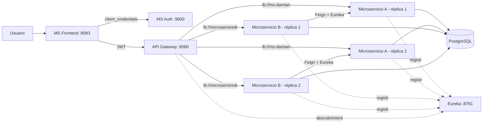

# Proyecto Docker - Microservicios A y B

Proyecto de evaluación construido a partir de los microservicios originales del equipo:

- **Microservicio A (`ms-damian`)**: CRUD de `EntityA`.
- **Microservicio B (`microserviciob`)**: CRUD de `EntityB` y consumo de A con OpenFeign.
- **Eureka**: registro y descubrimiento de instancias.
- **API Gateway**: punto de entrada protegido y balanceo con rutas `lb://`.
- **MS Auth**: servidor OAuth2 que emite JWT mediante `client_credentials`.
- **MS Frontend**: aplicación Web Spring MVC + Thymeleaf.
- **PostgreSQL**: servidor de base de datos con esquemas separados para A y B.

Los proyectos originales de OneDrive no se modifican. Esta carpeta es la copia autocontenida para la entrega.

## Arquitectura



Todos los componentes Spring Web MVC usan Tomcat embebido, incluido Gateway MVC. Los microservicios A y B no publican puertos al host: solo pueden alcanzarse dentro de la red Docker y a través del Gateway.

## Requisitos

- Docker Desktop con Docker Compose.
- Al menos 4 GB de memoria disponible para Docker.
- PowerShell 7 recomendado para ejecutar la prueba automatizada.

No es necesario instalar Java, Gradle, Maven ni PostgreSQL en el equipo: las imágenes multi-etapa realizan la compilación y los contenedores incluyen los runtimes.

## Ejecución

Desde esta carpeta:

```powershell
Copy-Item .env.example .env
docker compose up -d --build
docker compose ps
```

Compose crea dos réplicas de A y dos de B. Los accesos son:

| Componente | URL |
|---|---|
| Frontend | http://localhost:8083 |
| API Gateway | http://localhost:8080 |
| Eureka | http://localhost:8761 |
| Authorization Server | http://localhost:9000 |
| PostgreSQL | localhost:5432 |

El cliente OAuth2 de demostración se configura en `.env`:

- `client_id`: `frontend-client`
- `client_secret`: `secret123`
- `grant_type`: `client_credentials`
- scopes: `read write`

Estas credenciales son exclusivamente locales y deben reemplazarse por secretos administrados antes de un despliegue real.

## Prueba integral

```powershell
./scripts/smoke-test.ps1
```

La prueba valida:

1. Respuesta `401 Unauthorized` al invocar el Gateway sin JWT.
2. Emisión correcta del JWT por `ms-auth`.
3. Acceso a A y B a través del Gateway.
4. Dos instancias diferentes observadas para A y dos para B.
5. Registro de servicios en Eureka.
6. Integración B -> A con Feign/Eureka, verificada por el campo `nombreA`.

Cada microservicio agrega el encabezado `X-Service-Instance`, usado únicamente para demostrar qué réplica respondió.

## Operaciones útiles

```powershell
# Ver contenedores y salud
docker compose ps

# Ver registros de un componente
docker compose logs --tail=100 api-gateway
docker compose logs --tail=100 microservicio-b

# Detener conservando los datos
docker compose down

# Reiniciar desde cero (elimina también la base de datos)
docker compose down -v
```

## Persistencia

PostgreSQL utiliza el volumen `postgres-data`. El esquema `msa` contiene `entity_a`; `msb` contiene `entity_b` y la tabla de relación. Las dos réplicas de cada microservicio comparten la misma base de datos, por lo que los datos permanecen consistentes al balancear peticiones.

## Repositorio para la entrega

Inicializa Git en esta carpeta, crea un repositorio en la cuenta del equipo y pega su URL en el PDF final:

```powershell
git init
git add .
git commit -m "Proyecto Docker con microservicios A y B"
git branch -M main
git remote add origin https://github.com/2023371111-collab/Evaluacion4.git
git push -u origin main
```

No ejecutes `docker compose down -v` si deseas conservar los datos de PostgreSQL.

